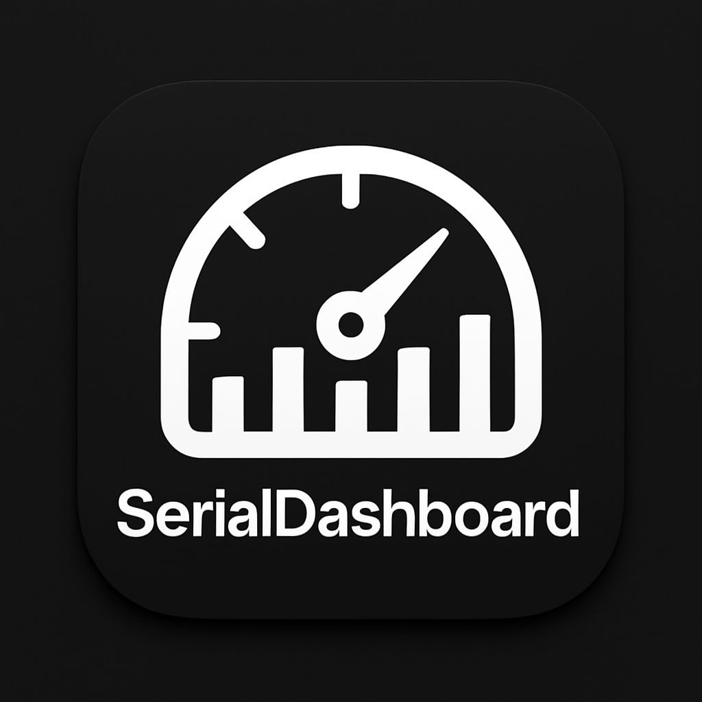

# 🌡️ Environmental Sensor Dashboard

A cross-platform desktop application for monitoring environmental sensor data with real-time visualization and data logging capabilities.



## ✨ Features

- � **Real-time data visualization** - Monitor sensor data with live charts and graphs
- 🔌 **Serial port communication** - Connect environmental sensors via USB/Serial
- 📈 **Interactive charts** - Zoom, pan, and analyze your data
- 💾 **Data logging & export** - Save and export data in CSV format
- 🖥️ **Cross-platform** - Works on macOS, Windows, and Linux
- 🐍 **No setup required** - Python backend fully bundled
- 🌓 **Dark/Light themes** - Choose your preferred interface
- 🚀 **Auto-builds** - Automatically builds for all platforms via GitHub Actions

## 📥 Download & Install

### [📦 Download Latest Release](https://github.com/MRU-Earth-and-Enviromental-Science/sensor-dashboard/releases/latest)

#### For macOS:
- **Intel Macs** (2020 and earlier): Download the `.dmg` file without `-arm64`
- **Apple Silicon Macs** (M1/M2/M3): Download the `-arm64.dmg` file

#### For Windows:
- **Installer** (recommended): Download the `Setup.exe` file
- **Portable**: Download the standalone `.exe` file

## 🚀 Quick Start

1. **Download** the appropriate file for your system
2. **Install** the application:
   - **Mac**: Open DMG, drag to Applications, right-click → "Open" on first run
   - **Windows**: Run the installer or portable executable
3. **Connect** your environmental sensor via USB
4. **Launch** the application
5. **Select** your serial port and start monitoring!

## 🔧 Automated Builds

This project uses GitHub Actions to automatically build desktop applications for all platforms:

### Continuous Integration
- **Builds** on every push to main branch and pull requests
- **Tests** all platforms: Windows x64, macOS Intel, macOS ARM64
- **Artifacts** are stored for 30 days for testing

### Automated Releases
- **Manual releases**: Go to Actions → "Create Release" → Run workflow
- **Version tagging**: Automatically updates package.json and creates git tags
- **Multi-platform**: Builds Windows Setup/Portable and macOS Intel/ARM64 versions
- **GitHub Releases**: Automatically creates releases with proper file naming

### For Developers
To trigger a new release:
1. Go to the repository's Actions tab
2. Select "Create Release" workflow
3. Click "Run workflow"
4. Enter version (e.g., `v1.0.1`)
5. The system will build and publish automatically

## � Supported Sensors

The dashboard works with environmental sensors that output data via serial communication, including:
- Temperature and humidity sensors
- Air quality monitors
- Weather stations
- Custom sensor configurations
- Arduino/ESP32 based sensor arrays

## 📋 System Requirements

- **macOS**: 10.13 or later
- **Windows**: 7 or later
- **RAM**: 4GB minimum, 8GB recommended
- **Storage**: 500MB free space
- **USB port** for sensor connectivity

## 🛠️ Development

To build from source:

```bash
# Clone the repository
git clone https://github.com/MRU-Earth-and-Enviromental-Science/sensor-dashboard.git
cd sensor-dashboard

# Install dependencies
npm install

# Set up Python environment
python3 -m venv venv
source venv/bin/activate  # On Windows: venv\Scripts\activate
pip install -r requirements.txt

# Development mode
npm run electron-dev

# Build for distribution
npm run dist-mac    # macOS
npm run dist-win    # Windows
npm run dist-linux  # Linux
```

## 📞 Support

- 🐛 **Report Issues**: [GitHub Issues](https://github.com/MRU-Earth-and-Enviromental-Science/sensor-dashboard/issues)
- 📖 **Documentation**: Check the repository wiki
- 💬 **Community**: Join our discussions

## 📄 License

This project is open source. See the LICENSE file for details.

## 🤝 Contributing

Contributions are welcome! Please feel free to submit a Pull Request.

---

**Ready to start monitoring?** [Download the latest release](https://github.com/MRU-Earth-and-Enviromental-Science/sensor-dashboard/releases/latest) and get started in minutes! 🌱
# Sensor Dashboard Setup Guide

This README will guide you through setting up Git, cloning the required repository, configuring GitHub, installing Visual Studio Code (VS Code), and setting up PlatformIO.

## 1. Install Git

- Visit the official Git website: [https://git-scm.com/downloads](https://git-scm.com/downloads)
- Download and install Git for your operating system (Windows, macOS, or Linux).
- After installation, open your terminal and check the installation:
  ```sh
  git --version
  ```
  You should see the installed Git version.

## 2. Configure Git with GitHub

- Set your Git username and email (replace with your details):


  # Sensor Dashboard Setup Guide

  This README will guide you through setting up Git, installing VS Code, flashing code to ESPs, setting up the Raspberry Pi, configuring the Sensor Dashboard, starting the backend, and launching the full system.

  ---

  ## 1. Install Git and Clone Repositories

  1. **Install Git:**
    - Visit the official Git website: [https://git-scm.com/downloads](https://git-scm.com/downloads)
    - Download and install Git for your operating system (Windows, macOS, or Linux).
    - After installation, open your terminal and check the installation:
      ```sh
      git --version
      ```
      You should see the installed Git version.

  2. **Configure Git with GitHub:**
    - Set your Git username and email (replace with your details):
      ```sh
      git config --global user.name "Your Name"
      git config --global user.email "your.email@example.com"
      ```
    - Generate an SSH key (recommended for authentication):
      ```sh
      ssh-keygen -t ed25519 -C "your.email@example.com"
      ```
    - Add your SSH key to your GitHub account:
      - Copy your public key:
       ```sh
       cat ~/.ssh/id_ed25519.pub
       ```
      - Go to [GitHub SSH settings](https://github.com/settings/keys) and add the key.
    - Test your connection:
      ```sh
      ssh -T git@github.com
      ```

  3. **Clone the Repositories:**
    - In your terminal, navigate to the directory where you want to clone the projects.
    - Clone the Low-Cost Sensors repo:
      ```sh
      git clone https://github.com/MRU-Earth-and-Enviromental-Science/Low-Cost-Sensors
      ```
    - Clone the Sensor Dashboard repo (current repo):
      ```sh
      git clone https://github.com/MRU-Earth-and-Enviromental-Science/sensor-dashboard.git
      ```

  ---

  ## 2. Install Visual Studio Code (VS Code)

  1. **Download and Install VS Code:**
    - Download VS Code from [https://code.visualstudio.com/](https://code.visualstudio.com/)
    - Install it for your operating system.
    - Open VS Code and use the built-in terminal or editor for development.

  2. **Set Up PlatformIO in VS Code:**
    - Open VS Code.
    - Go to Extensions (left sidebar) and search for "PlatformIO IDE".
    - Click "Install" to add PlatformIO to VS Code.
    - After installation, you can access PlatformIO from the VS Code sidebar.
    - Use PlatformIO to build, upload, and monitor your embedded projects.

  ---

  ## 3. Flash Code to ESP Devices

  1. **Connect ESP Devices:**
    - Plug each ESP device into your computer via USB.

  2. **Open the Project in VS Code:**
    - Open the relevant ESP project folder in VS Code.

  3. **Build and Upload Code:**
    - Use PlatformIO to build and upload the firmware to each ESP:
      - Click the PlatformIO "Upload" button or run:
       ```sh
       pio run --target upload
       ```
    - Repeat for both ESP devices.

  ---

  ## 4. Raspberry Pi Hardware and Software Setup

  1. **Power the Pi:**
    - Plug a battery pack into the Raspberry Pi to power it up.

  2. **Connect Peripherals:**
    - Connect the Pi to your computer or monitor using an HDMI cable.
    - Plug in a keyboard (and mouse, if needed).

  3. **Log In:**
    - When prompted, log in with:
      - **Username:** `shivamwalia`
      - **Password:** `Neon_2017`

  4. **Connect the Drone:**
    - Plug the drone into the Raspberry Pi using a UART cable (connect the cable to the drone first).

  5. **Connect the ESPs:**
    - Plug the ESP devices into the Pi after the drone is connected.

  6. **Set Up ROS Environment:**
    - Open a terminal on the Pi.
    - Run the following command to set up ROS:
      ```sh
      source /opt/ros/noetic/setup.bash
      ```

  7. **Navigate to the Project Repository:**
    - List the directories to confirm the repo is present:
      ```sh
      ls
      ```
    - Change into the project directory:
      ```sh
      cd Low-Cost-Sensors/ros_workspace
      ```
    - Source the workspace setup:
      ```sh
      source devel/setup.bash
      ```

  ---

  ## 5. Set Up the Sensor Dashboard Repository (Frontend)

  1. **Install Node.js and npm:**
    - Visit the official Node.js website: [https://nodejs.org/](https://nodejs.org/)
    - Download and install the LTS version for your operating system.
    - After installation, verify in your terminal:
      ```sh
      node --version
      npm --version
      ```
      You should see the installed versions of Node.js and npm.

  2. **Install Electron Globally:**
    - In your terminal, run:
      ```sh
      npm install -g electron
      ```
    - This will install Electron globally for development.

  3. **Install Dependencies:**
    - In the `sensor-dashboard` project directory, run:
      ```sh
      npm install
      ```
    - This will install all required packages listed in `package.json`.

  4. **Start the Application:**
    - To run the Electron app (if applicable), use:
      ```sh
      npm run dev
      ```
    - Or follow any additional instructions in the repo's documentation.

  ---

  ## 6. Start the Backend

  1. **Set Up Python Environment:**
    - Make sure you have Python 3 installed. You can check with:
      ```sh
      python3 --version
      ```
    - (Optional) Create and activate a virtual environment:
      ```sh
      python3 -m venv venv
      source venv/bin/activate
      ```

  2. **Install Python Dependencies:**
    - Install required packages from `requirements.txt`:
      ```sh
      pip install -r requirements.txt
      ```

  3. **Start the Backend Server:**
    - Run the backend Python script:
      ```sh
      python3 serial_backend.py
      ```
    - The backend should now be running and ready to communicate with the frontend.

  Refer to the project documentation for any additional backend configuration or environment variables.

  ---

  ## 7. Launch the Full System

  1. **Launch the ROS System:**
    - In the Pi terminal, run:
      ```sh
      roslaunch sensor_monitor full_system.launch
      ```

  2. **Disconnect HDMI (Optional):**
    - Once the system is running, you can disconnect the Pi from HDMI.
    - Ensure all cables (UART, ESP, power) remain securely connected so the system continues to operate.

  Your sensor monitoring system should now be running independently on the Raspberry Pi.
